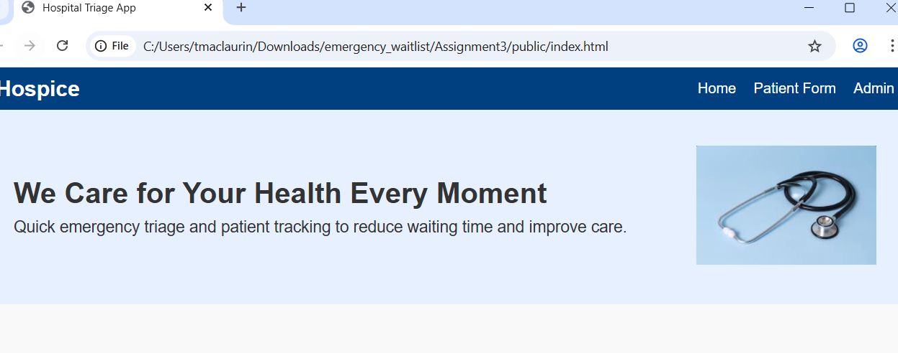
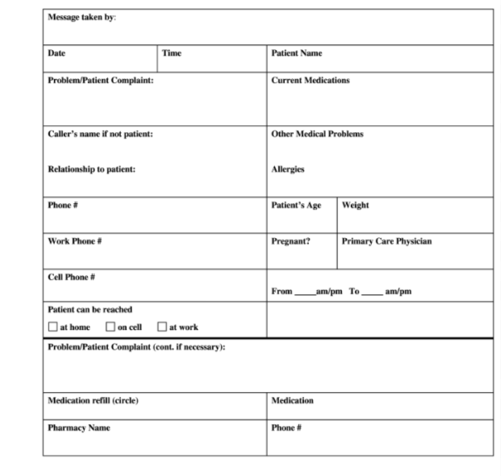

## Hospital Triage App Design Document

### Design Overview
The Hospital Triage App is designed to create an efficient, user-friendly flow for both patients and administrative staff. The system focuses on clarity, accessibility, and ease of navigation. Patients can quickly enter injury information, while administrators can manage and prioritize submissions. The design system ensures consistency across pages and components.

## 1. Fonts
### Primary Fonts Used (Roboto)
- **Usage:** Titles, section headers, button labels  
- **Font Weights:** Regular (400), Medium (500), Bold (700)  
- **Reasoning:** Roboto is modern, clean, and highly readable on mobile and web. Bold weights make titles stand out.

### Open Sans
- **Usage:** Body text, descriptions, form labels, instructions  
- **Font Weights:** Light (300), Regular (400)  
- **Reasoning:** Open Sans provides a softer, accessible reading experience for longer text.

### Why These Fonts?
- Web-safe and mobile-friendly  
- Clear distinction between headings and body text  
- Maximizes readability in an emergency context  
- Consistent styling across User and Admin pages

## 2. Colour Palette
### User Interface Colours (Patient Page)
- **Blue** — #3A7BDB — Primary buttons, headings  
- **Light Blue** — #DCEBFA — Background areas, cards  
- **Neutral Grey** — #F2F2F2 — Page background, input fields  
- **Dark Text Grey** — #333333 — Text for readability

### Admin Interface Colours (Admin Page)
- **Dark Grey** — #2C2C2C — Primary background, cards  
- **Slate Grey** — #505050 — Secondary buttons, borders  
- **Alert Red** — #b53834ff — Urgent actions, high-priority patients  
- **White** — #FFFFFF — Text for contrast

## 3. App Components
### Titles
- **User Page Title:** "Hospital Triage – User"  
- **Admin Page Title:** "Hospital Triage – Admin"  
**Design:** Roboto Bold 32px, center-aligned, page-specific accent color.

### Descriptions
- Placed below titles, written in Open Sans Regular to give instructions/context.

### Patient Questionnaire
- **Location:** User page  
- **Components:** Injury type dropdown/button list, pain level slider or buttons, submit button  
- **Design Choices:** Large touch-friendly controls, Calming Blue for primary actions, clear spacing, inline error messages

**Data Flow:** selects weather your admin or patient - if user User submits the form - form appears in Admin Summary

### Admin Summary Dashboard
- **Location:** Admin page  
- **Features:** Table/list of submissions showing name (if provided), injury type, pain level, assigned attention level  
- **Admin Controls:** Increase priority, Decrease priority, Remove user  
- **Design Choices:** Dark Grey background with white text, red highlights for urgent cases, action-sized buttons, two-column layout for clarity

## 4. Layout and Navigation
### General Layout
- Responsive grid layout for phones, tablets, desktops  
- Balanced spacing; consistent paddings/margins (16–24px)

### Navigation
- **Mobile:** Fixed bottom nav (Home, Admin, Back)  
- **Desktop:** Top nav bar

## 5. Consistency Guidelines
### Colors
- Use only palette colors defined above.

### Buttons
- Rounded corners (8px), Roboto Medium, defined hover/pressed states.

### Input Fields
- Grey borders, clear placeholder text, minimum 44px height for accessibility.

### Icons
- Simple, filled icons; avoid decorative or thin-line icons.

## 6. Component Integration
### User Page Contains:
- Title + description, questionnaire fields, submit button.  
Uses the User color palette + Roboto/Open Sans font system for a calm experience.

### Admin Page Contains:
- Title + description, patient summary list, action buttons, red alert indicators.  
Designed for speed and clarity.

## 7. App Functionality Overview
### User Interaction Flow
1. User selects injury type  
2. User selects pain level  
3. User submits form  
4. Submission is sent to Admin page

### Admin Workflow
1. Admin sees submissions in real time  
2. Admin adjusts triage priority  
3. Admin removes patient from list if needed  
4. Admin uses color-coded indicators to prioritize

## Team Information
**Taia Maclaurin**

## refrence 
- https://uicookies.com/free-bootstrap-hospital-templates/
- https://github.com/kvhuang23/cst3106_labs/blob/236d6e01304896696d0514b230eb1cf4a450153f/lab10/hospital_triage_design_system.md