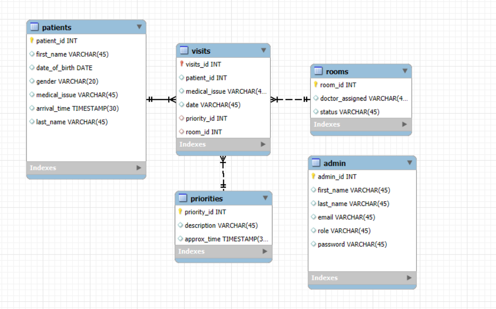

## Overview
This document describes the relational database design for the Hospital Triage application. The database models patients arriving to an emergency triage, their priorities, room assignments, and administration of the triage system. It supports tracking patient waitlists, room availability, and administrative actions.

## Entities & Attributes
## 1. Patient
- Description: Represents a person seeking triage/medical attention.
- Attributes:
    - card_number (PK) — varchar
    - name — varchar
    - gender — varchar
    - date_of_birth — date
    - medical_issue — varchar
    - arrival_time — timestamp
- priority_id (FK → Priorities.priority_id) — integer, not null
- room_id (FK → Rooms.room_id) — integer, nullable
**Notes:** card_number uniquely identifies each patient. Patients are assigned a priority and optionally a room.

## 2. Priority
- Description: Standard triage categories based on severity.
- Attributes:
    - priority_id (PK) — integer, auto-increment
    - description — varchar (e.g., "High", "Medium", "Low")
    - approximate_time — integer (minutes, expected wait)
**Notes:** Used to sort patients in the waitlist queue.

## 3. Room
- Description: Tracks rooms and doctor assignments.
- Attributes:
    - room_id (PK) — integer, auto-increment
    - doctor_assigned — varchar
    - status — boolean (TRUE = occupied, FALSE = available)
**Notes:** Rooms are assigned to patients based on availability.

## 4. Admin
- Description: Represents administrative staff managing the triage system.
- Attributes:
    - admin_id (PK) — integer, auto-increment
    - first_name — varchar
    - last_name — varchar
    - email — varchar
    - role — varchar (Admin, Triage Nurse)
    - password — varchar
**Notes:** Admins can view all patients, update priorities, assign rooms, and track wait times.

## Relationships & Cardinalities
Patient (N) - (1) Priority
Many patients can share the same priority; each patient has one priority.

Patient (N) - (1) Room
Many patients may be assigned to the same room over time; each patient occupies one room at a time (nullable if not assigned).

Admin (1) — (N) Patient updates
Admins manage multiple patients’ priority and room assignments.

## Primary Keys (PK) and Foreign Keys (FK)
- Patient.card_number (PK); Patient.priority_id (FK → Priority.priority_id); Patient.room_id (FK → Room.room_id)
- Priority.priority_id (PK)
- Room.room_id (PK)
- Admin.admin_id (PK)

## Indexing 
- Index Patient.priority_id for fast retrieval of patients by triage category.
- Index Patient.arrival_time to quickly order patients by arrival.
- Index Room.status to quickly find available rooms.
